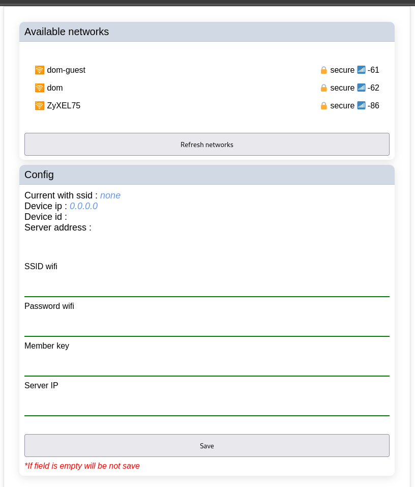
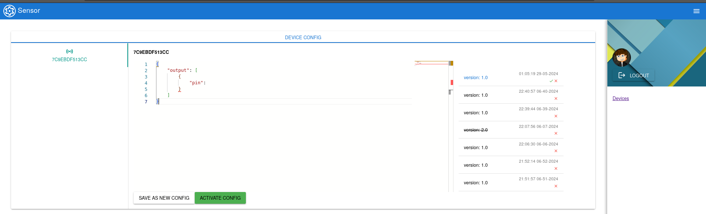

# SENSOR PROJECT

## Why?

I want to create a simple system for remote management of devices like ESP and others. The project will also contain a user-friendly API to create a flow process.

## Structure of the Project

- `sensor-core`:
  One of the main modules. This module contains the DB layer, services, and others.
- `sensor-api`:
  This module provides a layer of communication between MQTT and our own application.
  - esp <-> mqtt <-> sensor-api <-- sensor-core <-- database
- `sensor-gui`:
  Contains GUI and API for the Frontend.
- `sensor-eureka`:
  Provides discovery for sensor-api for sensor-gui, e.g., send new config.
- `bin`:
  - `esp-firmware`:
    Firmware for ESP 32. The project is written in C language for ESP IDF.
  - `defaultConfig.json` contains the default config for firmware.
  - `schema.json` contains the specification based on the API payload documentation for firmware.
  - [payload](bin/payload/README.md) contains API payload between device and sensor-api.

### Esp Panel GUI

### GUI Panel

### My Plan
#### ESP32:
* ~~Support ANALOG~~
* ~~Support PWM~~
* Support UART
* Support I2C
* Support SPI
* Dynamic OTA firmware update
* Create a layout and mechanism for managing flow for devices and sensors
* Add the possibility to upload firmware to the GUI
* Add a panel to the GUI to read logs from a connected device via USB
* Create a flow mechanism for devices and sensors

### Technologies

JAVA, C, MQTT, POSTGRES, NUXT
