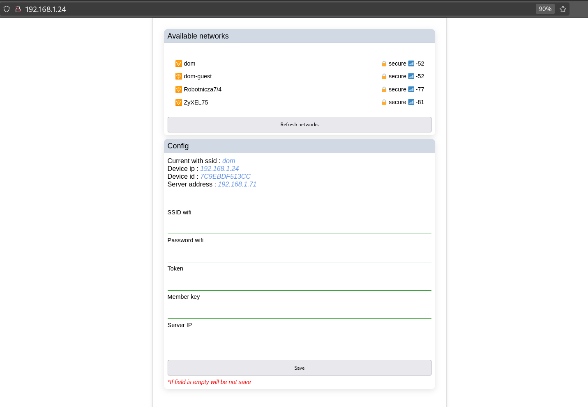
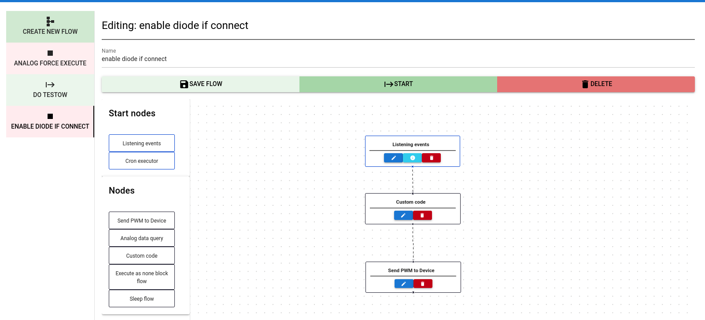
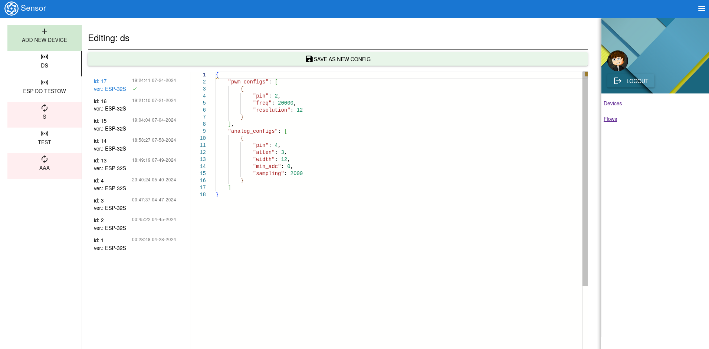

# SENSOR PROJECT

## Why?

I want to create a simple system for remote management of devices like ESP and others. The project will also contain a
user-friendly API to create a flow process.

## Structure of the Project

- `sensor-app`:
  One of the main modules. This module contains the DB layer, services, and others.
  This module provides a layer of communication between MQTT and our own application.
    - esp <-> mqtt <-> sensor-app <-- database
      Contains GUI and API for the Frontend.
      Component that manages flows and their launch

- `firmwares`:
    - `esp-firmwares`:
      Firmware for ESP 32. The project is written in C language for ESP IDF.
    - `defaultConfig.json` contains the default config for firmwares.
    - `schema.json` contains the specification based on the API payload documentation for firmwares.
    - [payload](documentation/README.md) contains API payload between device and sensor-api.

### Voice to Text

- If you want change voice model, you need to change the contents of the folder
- [Voice Model Folder](docker/data/config/voice-model)
- https://github.com/alphacep/vosk-api

### Esp Panel GUI

### Flow config

### Device config

### My Plan

#### ESP32:

* ~~Support ANALOG~~
* ~~Support PWM~~
* Support UART
* Support I2C
* Support SPI
* Dynamic OTA firmwares update
* ~~Create a layout and mechanism for managing flow for devices and sensors~~
* Add the possibility to upload firmwares from the GUI
* Add a panel to the GUI to read logs from a connected device via USB
* ~~Create a flow mechanism for devices and sensors~~

### Technologies

JAVA, C, MQTT, POSTGRES, NUXT

